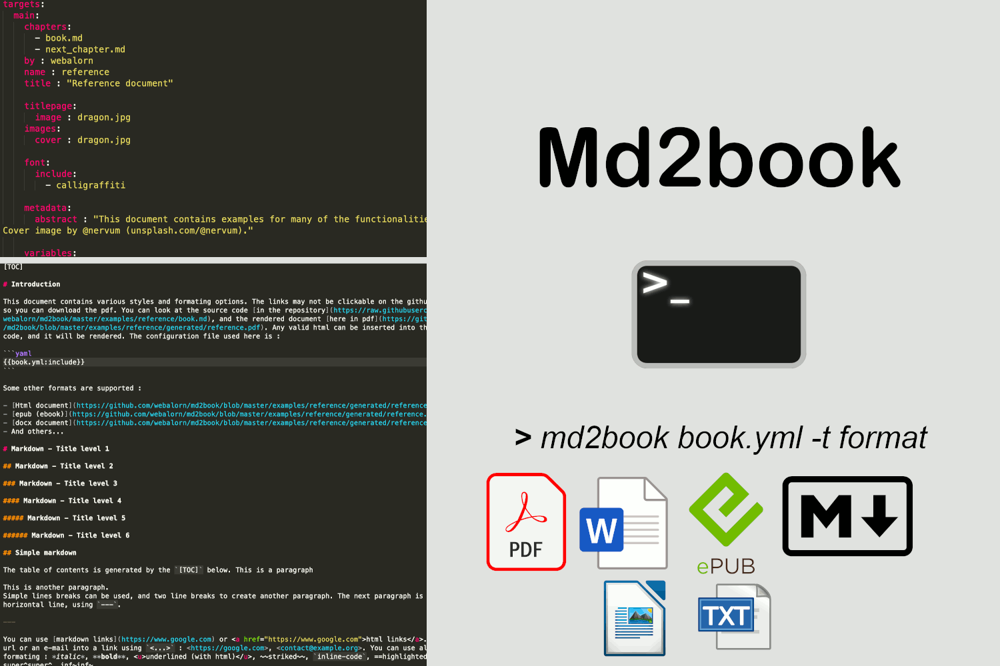

# Md2book

Md2book converts books written with markdown within multiple files into a single, standalone file, and allows exporting to pdf, ebook (epub), docx, odt, markdown or text. This projects makes it easy by using simple configuration files written in yaml. It supports markdown syntax, LaTeX equations, themes, css, fonts, and settings to easily configure the style.

Because an example is better than words, [here is a document generated](https://github.com/webalorn/md2book/blob/master/examples/reference/generated/reference.pdf) using md2book.

## About md2book

Md2book is designed to be used by users that are comfortable with the command line interface and want a simple, free and fully customizale tool to manage theirs writings. If you want a more easy-to-use tool, with a GUI, check out [scrivener](https://www.literatureandlatte.com/scrivener/overview) (paying) or free online alternatives. If you want to use md2book, you will only need a markdown editor, like [typora](https://typora.io/).

### Why md2book instead of pandoc ?

Md2book uses pandoc, wkhtmltopdf and some python packages to generate documents. But I spent time optimizing the result to have better-looking documents. For example, `python-docx` is used to improve docx files generated by pandoc (but do not correct all pandoc issues). Md2book comes with predefined themes and fonts, and makes it easy to compile a document using styles, themes, fonts, to any target format. It has a template system, and read all you need to configure from a single file.

## Start using md2book

All the instructions are available on the [wiki](https://github.com/webalorn/md2book/wiki).

- [Wiki Home](https://github.com/webalorn/md2book/wiki)
- [Installation](https://github.com/webalorn/md2book/wiki/Install)
- [Quick Start](https://github.com/webalorn/md2book/wiki/Quick-start)
- [And the full documentation on the wiki](https://github.com/webalorn/md2book/wiki)

## License

[MIT](https://github.com/webalorn/md2book/blob/master/LICENSE)